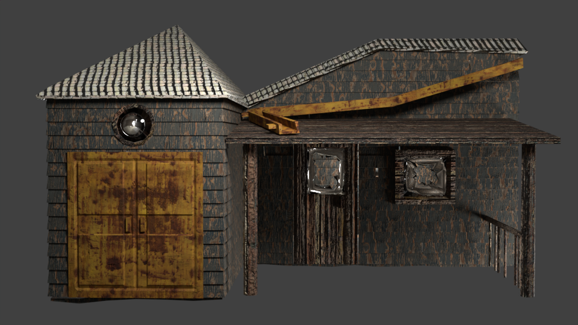
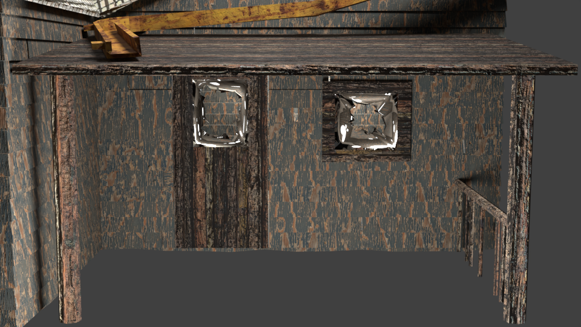
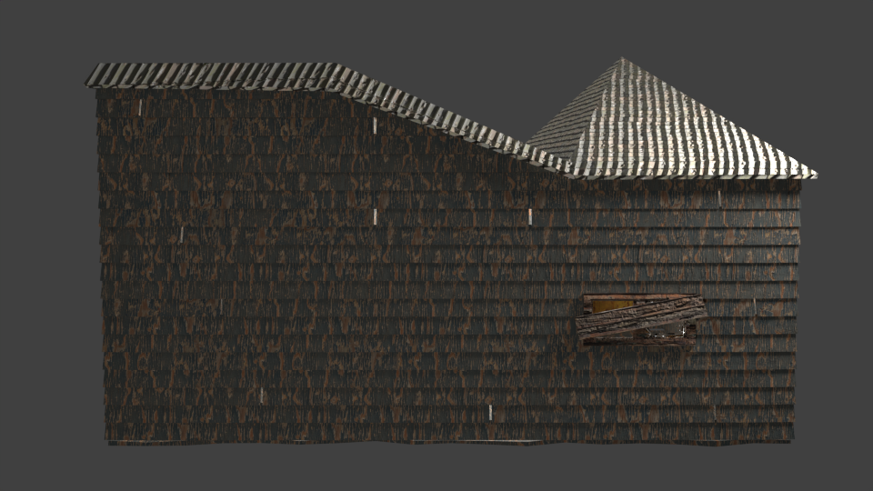
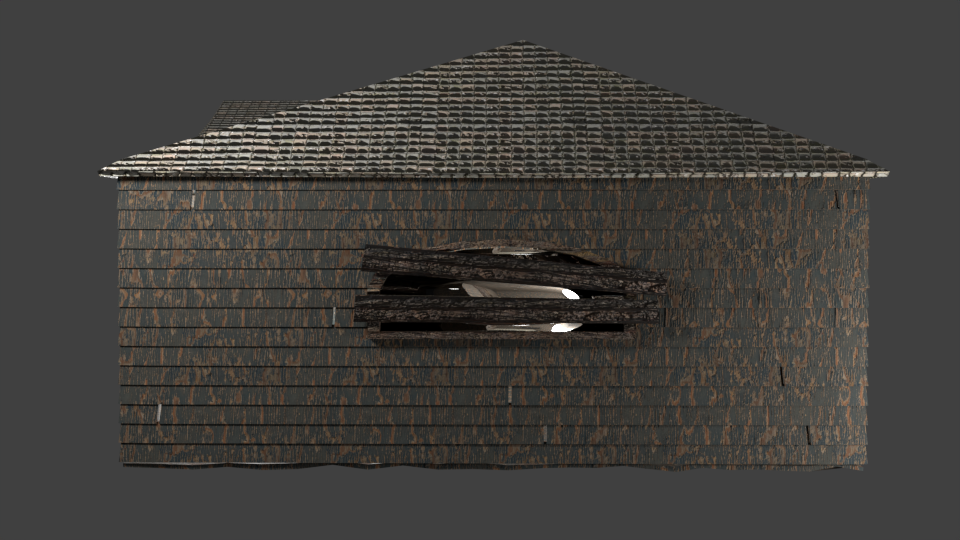
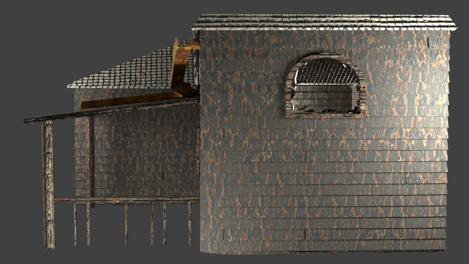

# Abandoned Wooden House 3D Asset

## Overview

This project showcases a **game-ready 3D model of an abandoned wooden house**, designed **100% by me** and textured entirely in Blender, then exported to Unity. The model features a rustic, weathered design with broken windows, wooden planks blocking access, a rusted gutter, a small porch, and garage doors. Its optimized topology and old abandoned details make it a perfect fit for horror, survival, or post-apocalyptic game environments.

## Technical Specifications

- **Modeling Software**: Blender 3.6.2
- **Polygon Count**: 10,547 vertices
  - Topology: 100% tris/quads (no n-gons) and no non-manifold geometries
- **Texture Resolution**: 4K PBR Maps imported from Poly Haven
  - Albedo, Normal, Roughness, Displacement

## Asset Details

### Modeling Techniques
I applied procedural and manual modeling to make sure I got all of the details right.
- I used the following Blender modifiers:
 - Displacement
 - Boolean
 - Array
 - Bevel
 - Mirror
 - Solidify

### Rendering Features
I sourced these textures from Poly Haven. 4K PBR textures.
- Albedo: For the surface colors.
- Normal: Adds the realistic depth and surface detail.
- Roughness: Defines the aged, weathered look of the wood and metal.
- Displacement: Creates physical depth for wooden planks and roofing.

## Use Cases
This asset is perfect for:

- Horror Games: The blocked windows and the weathered design create a sense of abandonment and unease.
- Survival Games: The house offers a plausible setting for player interaction, scavenging, or refuge.
- Post-Apocalyptic Scenes: The decay and rustic elements fit seamlessly into desolate landscapes.

## Render Gallery

### Front View

*This front view provides a clear look at the primary features such as the porch, gutter, garage, broken windows and the porch.*

*This close-up of the porch highlights the broken glass on the windows, the falling gutter above the porch and the detailed textures up close.*

*This front view provides a clear look at the primary features such as the porch, gutter, garage, broken windows and the porch.*

### Back View

*This view showcases the back side of the house with a view to the back side windows being covered by a wooden plank.*

### Left View

*The left side view emphasizes the big window frame with two wooden planks blocking an entrance point*

### Right View

*This view from the right side captures the existance of a second floor with a broken window on the first floor.*

### Video
[Watch the full video render](renders/0001-0300.mp4)

*Watch the video to see the model up close.*

## Installation

Import FBX file, verify texture mapping and adjust tiling (I personally recommend 20x20)

## Future Improvements that can be made:
- Add door/plank animations.
- Make environment assets that enhance the visual appeal.
- Expand the interior for potential exploration mechanics.
