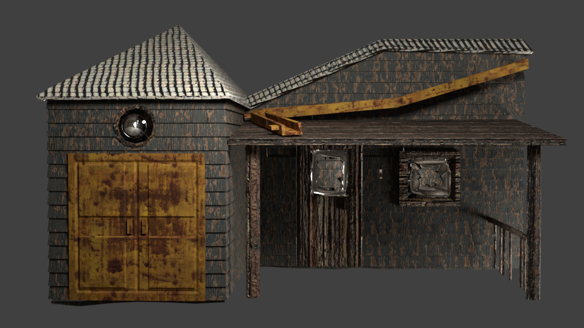
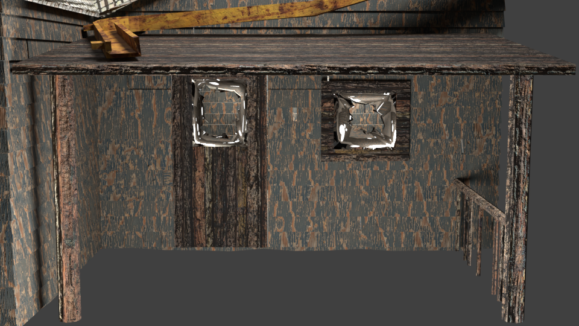

# Abandoned Wooden House 3D Asset

## Overview

My asset showcases a **game-ready 3D model of an abandoned wooden house**, designed **100% by me** and textured entirely (imported free textures) in Blender, then exported to Unity. The model features a rustic, weathered design with broken windows, wooden planks blocking access, a rusted gutter, a small porch, and garage doors. It has an optimized topology and old abandoned details make it a perfect fit for horror, survival, or post-apocalyptic game environments.

## Technical Specifications

- **Modeling Software**: Blender 3.6.2
- **Polygon Count**: 10,547 vertices
  - Topology: 100% tris/quads (no n-gons) and no non-manifold geometries
- **Texture Resolution**: 4K PBR Maps imported from Poly Haven
  - Albedo, Normal, Roughness, Displacement

## Asset Details

### Modeling Techniques
I used the following Blender modifiers:
 - Displacement
 - Boolean
 - Array
 - Bevel
 - Mirror
 - Solidify

### Rendering Features
I sourced these textures from Poly Haven. 4K PBR textures.
- Albedo: For the surface colors.
- Normal: Adds the realistic depth and surface detail.
- Roughness: Defines the aged, weathered look of the wood and metal.
- Displacement: Creates physical depth for wooden planks and roofing.

## Use Cases
This asset is perfect for:

- Horror Games providing a sense of abandonment and unease with its blocked windows and weathered design.
- Survival Games showing a realistic setting for scavenging or player interaction.
- Post-Apocalyptic Games due to its decayed and rustic elements.

## Render Gallery

### Front View

*This front view provides a clear look at the primary features such as the porch, gutter, garage, broken windows and the porch.*

### Front View - Close-up

*This close-up of the porch highlights the broken glass on the windows, the falling gutter above the porch and the detailed textures up close.*

### Video
[Watch the full video render](https://www.youtube.com/watch?v=ZCVFiCs35Rg)

*Watch the video to see the model up close.*

## Installation

Import FBX file, verify texture mapping and adjust tiling (I personally recommend 20x20)

## Future Improvements that can be made:
- Add door/plank animations.
- Make environment assets that enhance the visual appeal.
- Expand the interior for potential exploration mechanics.
